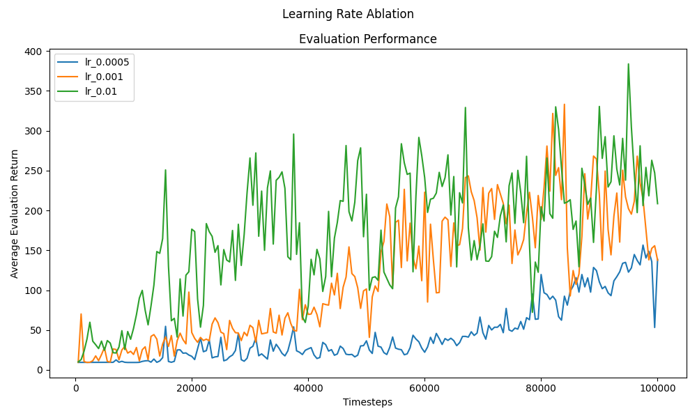

# Deep Reinforcement Learning - RL_A0

This project contains implementations and experiments for deep reinforcement learning techniques, including Q-Learning and Deep Q-Networks (DQN). 
The experiments are conducted on the CartPole environment using various configurations and ablation studies.

### 🔬 Ablation Studies

Ablation studies were conducted on different hyperparameters:

- **Learning Rate:** (0.0001, 0.0005, 0.001)
- **Hidden Layer Size:** ([16], [32], [64])
- **Discount Factors (γ):** (0.95, 0.99, 0.999)
- **Epsilon Decay Factors:** (0.99, 0.995, 0.999)
- **Components:**
  - Naive Model: No target network, no experience replay
  - Target Network (TN) only
  - Experience Replay (ER) only
  - ER + TN Model

## 📁 Project Structure

- **`RLA1.py`**: Main script containing the implementation of the DQN agent, training loop, and ablation studies.
- **`plotCombine.py`**: Script for combining and visualizing results from different experiments (Naive / TN / ER / TN+ER).

## How to Run

1. Install dependencies:
   
   pip install -r requirements.txt
   
   Ensure you have Python 3.8+ installed.

2. Run the main script:
   
   python **RLA1.py**
   
   This will show the result of ablation study and Component Study, saved in PNG and JSON files independently.

4. Visualize results:
   
   python **plotCombine.py**
   
   **Note**: when combining the plot from JSON file, make sure to add the Correct location of the JSON files of the result for Naive - Only TN - Only ER - TN & ER. 

<h3>📊 Example Results</h3>

  
  

Results from experiments are saved in the `results` directory. Plots and JSON files summarize the performance of different configurations.

## Requirements:
- Python 3.8+
- torch, gymnasium, matplotlib, numpy, tqdm
